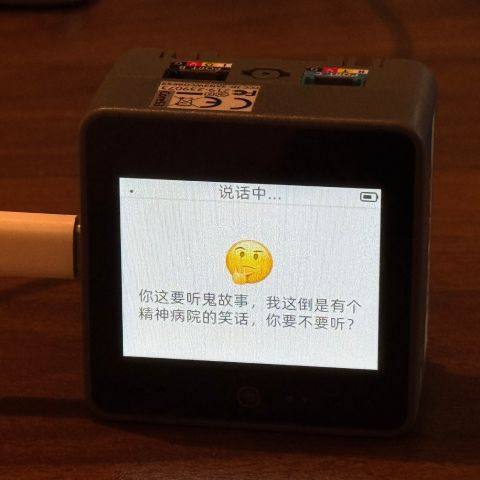
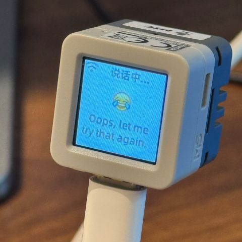
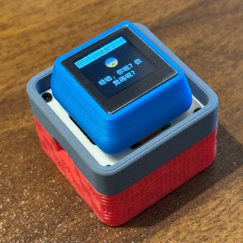

# An MCP-based Chatbot

(English | [中文](README.md) | [日本語](README_ja.md))

## Project Description

This project is an extension based on the [xiaozhi-esp32](https://github.com/78/xiaozhi-esp32) (v2.0.4 version) project. Below are some explanations of the additional features developed in this project:
- Added K210 audio tracking module
	- Audio target detection: integrated the MEMS7 microphone array and realized real-time sound source localization.
	- Gimbal control system: integrated two SG90 gimbals for dual-axis control, automatically tracking sound sources, preparing for the connection of cameras and other devices in the future.
	- ESP32S3 serial communication: implemented bidirectional UART communication between ESP32S3 and K210.
	- Status display: real-time display of gimbal angles and tracking status on the K210 LCD screen.
- MCP service: allows controlling the rotation and status of servos using voice commands.

## Pin Connections and Configuration

### Pin Connection Instructions

#### **sipeed maixbit K210 and MEMS7 Microphone Pin Connections**

```python
mic.init(
    i2s_d0=22,
    i2s_d1=23,
    i2s_d2=21,
    i2s_d3=20,
    i2s_ws=19,
    i2s_sclk=18, # MIC_CK
    sk9822_dat=10,
    sk9822_clk=9 # LED_CK
)
```

#### **K210 and two sg90 PWM pin connections**

| K210 PWM | sg90  |
| -------- | ----- |
| IO7      | Pitch |
| IO8      | Roll  |

#### **ESP32S3 N16R8 and sipeed maixbit K210 serial communication pin connections**


| esp32s3<br>UART1 | K210<br>UARTHS|
| ---------------- | ------------- |
| GPIO17 U1TXD     | IO4 ISP_RX (13) |
| GPIO18 U1RXD     | IO5 ISP_TX (12) |
| GND              | GND           |

### Servo Control Related Configuration

#### Parameter Example Configuration

```yaml
{
  "init_pitch": 50,                     # Pitch axis initial position (0-100)
  "init_roll": 50,                      # Roll axis initial position (0-100)
  "pitch_pid": [0.5, 0.02, 0.03, 5],    # Pitch axis PID parameters [P, I, D, I_max]
  "roll_pid": [0.5, 0.02, 0.03, 10],    # Roll axis PID parameters [P, I, D, I_max]
  "pitch_reverse": false,               # Pitch axis reverse control (true=reverse, false=forward)
  "roll_reverse": true,                 # Roll axis reverse control (true=reverse, false=forward)
  "audio_range": 10,                    # Audio detection output range (error amplification factor)
  "ignore_threshold": 0.1,              # Ignore threshold (sound intensity below this value will be ignored)
  "roll_range": [10, 90],               # Roll axis movement range limit [min angle, max angle]
  "lcd_rotation": 0,                    # LCD screen rotation angle (0/90/180/270)
  "pitch_scale": 1.8,                   # Pitch axis display scale factor (LCD visualization scaling)
  "roll_scale": 1.8,                    # Roll axis display scale factor (LCD visualization scaling)
  "main_timeout": 120,                  # Main program timeout (seconds, auto exit after this duration)
  "loop_delay": 0.01                    # Main loop delay (seconds, controls loop frequency)
}
```


#### Parameter Adjustment

Adjust system parameters by modifying `config.json` or directly modifying the default values in `config.py`:

##### 1. `ignore_threshold` (Ignore Threshold)

Meaning:

- Sound sources with intensity below this threshold will be ignored
- Higher value = less sensitive (filters out more small sounds)
- Lower value = more sensitive (responds to more faint sounds)

Effect:

```yaml
# Reduce sensitivity (only respond to loud sounds)
"ignore_threshold": 8    # Ignore sounds with intensity < 8, only respond to strong sources

# Increase sensitivity (respond to small sounds)
"ignore_threshold": 2    # Ignore sounds with intensity < 2, can detect light sounds

# Most sensitive (responds to almost all sounds)
"ignore_threshold": 0    # Ignore no sounds
```

Recommended values:

- Less sensitive (nursing home environment, filter background noise): 6-10
- Medium sensitive (normal indoor): 3-5
- High sensitive (quiet environment, need to detect soft sounds): 1-2

##### 2. `audio_range` (Audio Detection Range)

Meaning:

- Defines the effective sound source direction range [min angle, max angle]
- Narrower range = harder to trigger (only responds to specific directions)
- Wider range = easier to trigger (responds to larger range of sounds)

Effect:

```yaml
# Reduce sensitivity (only respond to directly in front)
"audio_range": [-30, 30]   # Only detect sounds within ±30° range

# Increase sensitivity (respond to almost all directions)
"audio_range": [-160, 160] # Detect sounds within ±160° range (close to 360°)

# Medium sensitivity
"audio_range": [-90, 90]   # Detect sounds within ±90° range (half circle)
```

Recommended values:

- Less sensitive (only focus on front): [-45, 45] or [-30, 30]
- Medium sensitive (front hemisphere): [-90, 90]
- High sensitive (almost omnidirectional): [-150, 150]

## Serial Communication and MCP Description

### UART Communication

**K210 Side**
```python
class UartComm:
    def __init__(self):
        # Initialize UART1, baud rate 115200
        # K210: IO4=RX(connect to ESP32 TX/GPIO17), IO5=TX(connect to ESP32 RX/GPIO18)

        # try:
        #     fm.unregister(fm.fpioa.UART1_RX)
        # except ValueError:
        #     pass
        # try:
        #     fm.unregister(fm.fpioa.UART1_TX)
        # except ValueError:
        #     pass

        # Release original mapping first to avoid conflict with REPL
        for func in (fm.fpioa.UARTHS_RX, fm.fpioa.UARTHS_TX):
            try:
                fm.unregister(func)
            except ValueError:
                pass

        try:
            # fm.register(13, fm.fpioa.UART1_RX, force=True)  # IO4 ← ESP32 TX
            # fm.register(12, fm.fpioa.UART1_TX, force=True)  # IO5 → ESP32 RX

            fm.register(board_info.PIN4, fm.fpioa.UARTHS_RX, force=True)  # IO4 ← ESP32 TX
            fm.register(board_info.PIN5, fm.fpioa.UARTHS_TX, force=True)  # IO5 → ESP32 RX

            print("(K210) UART pins registered: RX=IO4, TX=IO5")
        except:
            print("(K210) Failed to register UART1 pins")
            pass

        self.uart = UART(UART.UARTHS, 115200, read_buf_len=4096)
        print("(K210) UART initialized: 115200 baud")

    # Clear buffer
        if self.uart.any():
            self.uart.read()
            print("(K210) Cleared UART buffer")

    def send(self, data):
        """Send data to ESP32"""
        if isinstance(data, str):
            data = data.encode('utf-8')
        self.uart.write(data)
        # print(f"Sent to ESP32: {data}")
        print("Sent to ESP32: {}".format(data))
    
    def receive(self, timeout_ms=100):
        """Receive data from ESP32"""
        if self.uart.any():
            data = self.uart.read()
            if data:
                try:
                    return data.decode('utf-8')
                except:
                    return data  # Return raw bytes
        return None
    
    def receive_line(self, timeout_ms=1000):
        """Receive a line of data (ending with \n)"""
        start = time.ticks_ms()
        buffer = b''
        
        while time.ticks_diff(time.ticks_ms(), start) < timeout_ms:
            if self.uart.any():
                char = self.uart.read(1)
                print('(K210) Received char: {}'.format(char))
                if char:
                    buffer += char
                    if char == b'\n':
                        try:
                            return buffer.decode('utf-8').strip()
                        except:
                            return buffer
            time.sleep_ms(10)
        
        # Timeout check
        if buffer:
            result = buffer.decode('utf-8').strip() if buffer else None
            print("(K210) Timeout with partial data: [{}]".format(result))
            return result
        print("(K210) Receive line timeout with no data")
        return None
    
    def start_receive_task(self, callback):
        """Continuously receive data and call callback function to process
        
        Args:
            callback: Callback function, receives one parameter (received data)
        """
        while True:
            data = self.receive_line()
            if data:
                # print(f"Received from ESP32: {data}")
                print("(K210) Received from ESP32: {}".format(data))
                callback(data)
            time.sleep_ms(10)
```

**ESP32S3 Side**

`uart_K210.cc`
```C
#include "uart_K210.h"
#include <esp_log.h>
#include <freertos/FreeRTOS.h>
#include <freertos/task.h>

#define TAG "UART_K210(ESP32)"

void UartK210::Init() {
    uart_config_t uart_config = {
        .baud_rate = BAUD_RATE,
        .data_bits = UART_DATA_8_BITS,
        .parity = UART_PARITY_DISABLE,
        .stop_bits = UART_STOP_BITS_1,
        .flow_ctrl = UART_HW_FLOWCTRL_DISABLE
    };
    
    ESP_ERROR_CHECK(uart_param_config(UART_NUM_, &uart_config));
    ESP_ERROR_CHECK(uart_set_pin(UART_NUM_, TX_PIN, RX_PIN, 
                                  UART_PIN_NO_CHANGE, UART_PIN_NO_CHANGE));
    ESP_ERROR_CHECK(uart_driver_install(UART_NUM_, BUF_SIZE, 0, 0, NULL, 0));
    
    ESP_LOGI(TAG, "UART initialized: TX=%d, RX=%d, Baud=%d", 
             TX_PIN, RX_PIN, BAUD_RATE);
}

void UartK210::SendData(const char* data, size_t len) {
    uart_write_bytes(UART_NUM_, data, len);
    ESP_LOGI(TAG, "Sent to K210: %.*s (LOG)", len, data);
}

int UartK210::ReceiveData(uint8_t* buffer, size_t max_len, uint32_t timeout_ms) {
    return uart_read_bytes(UART_NUM_, buffer, max_len, 
                          pdMS_TO_TICKS(timeout_ms));
}

void UartK210::StartReceiveTask() {
    xTaskCreate([](void* param) {
        UartK210* uart = static_cast<UartK210*>(param);
        uint8_t buffer[BUF_SIZE];
        size_t index = 0;
        
        while (1) {
            uint8_t byte;
            int len = uart->ReceiveData(&byte, 1, 100);  // Read 1 byte at a time
            
            if (len > 0) {
                if (byte == '\n') {
                    // Received complete line
                    buffer[index] = '\0';
                    ESP_LOGI(TAG, "Received line: %s", buffer);
                    index = 0;  // Reset buffer
                } else if (index < BUF_SIZE - 1) {
                    buffer[index++] = byte;
                } else {
                    // Buffer full, discard
                    ESP_LOGW(TAG, "Buffer overflow, resetting");
                    index = 0;
                }
            }
        }
    }, "uart_rx_task", 4096, this, 5, NULL);
}
```

### MCP Registration

`gimbal_controller.h`
```C
void RegisterMcpTools() {
	auto& mcp_server = McpServer::GetInstance();
	
	// Get gimbal state
	mcp_server.AddTool("gimbal.get_state", 
		"Get the current state of the gimbal (pitch and roll servo positions)", 
		PropertyList(), 
		[this](const PropertyList& properties) -> ReturnValue {
			SendCommand("GET_STATE");
			ESP_LOGI(TAG, "Request gimbal state");
			return true;
		});

	// Roll left
	mcp_server.AddTool("gimbal.roll.turn_left", 
		"Turn the roll servo to the left", 
		PropertyList(), 
		[this](const PropertyList& properties) -> ReturnValue {
			SendCommand("ROLL_LEFT");
			ESP_LOGI(TAG, "Roll left");
			return true;
		});

	// Roll right
	mcp_server.AddTool("gimbal.roll.turn_right", 
		"Turn the roll servo to the right", 
		PropertyList(), 
		[this](const PropertyList& properties) -> ReturnValue {
			SendCommand("ROLL_RIGHT");
			ESP_LOGI(TAG, "Roll right");
			return true;
		});

	// Pitch up
	mcp_server.AddTool("gimbal.pitch.turn_up", 
		"Turn the pitch servo up", 
		PropertyList(), 
		[this](const PropertyList& properties) -> ReturnValue {
			SendCommand("PITCH_UP");
			ESP_LOGI(TAG, "Pitch up");
			return true;
		});

	// Pitch down
	mcp_server.AddTool("gimbal.pitch.turn_down", 
		"Turn the pitch servo down", 
		PropertyList(), 
		[this](const PropertyList& properties) -> ReturnValue {
			SendCommand("PITCH_DOWN");
			ESP_LOGI(TAG, "Pitch down");
			return true;
		});

	// Hold current position
	mcp_server.AddTool("gimbal.hold_position", 
		"Keep the servo in its current position (stop audio tracking)", 
		PropertyList(), 
		[this](const PropertyList& properties) -> ReturnValue {
			SendCommand("HOLD_POSITION");
			ESP_LOGI(TAG, "Hold position");
			return true;
		});

	// Reset to initial position
	mcp_server.AddTool("gimbal.reset", 
		"Reset the gimbal to initial position", 
		PropertyList(), 
		[this](const PropertyList& properties) -> ReturnValue {
			SendCommand("RESET");
			ESP_LOGI(TAG, "Reset to initial position");
			return true;
		});

	// Enable audio tracking
	mcp_server.AddTool("gimbal.enable_tracking", 
		"Enable audio source tracking", 
		PropertyList(), 
		[this](const PropertyList& properties) -> ReturnValue {
			SendCommand("ENABLE_TRACKING");
			ESP_LOGI(TAG, "Enable audio tracking");
			return true;
		});

	// Disable audio tracking
	mcp_server.AddTool("gimbal.disable_tracking", 
		"Disable audio source tracking", 
		PropertyList(), 
		[this](const PropertyList& properties) -> ReturnValue {
			SendCommand("DISABLE_TRACKING");
			ESP_LOGI(TAG, "Disable audio tracking");
			return true;
		});
}
```

👉 [Human: Give AI a camera vs AI: Instantly finds out the owner hasn't washed hair for three days【bilibili】](https://www.bilibili.com/video/BV1bpjgzKEhd/)

👉 [Handcraft your AI girlfriend, beginner's guide【bilibili】](https://www.bilibili.com/video/BV1XnmFYLEJN/)

As a voice interaction entry, the XiaoZhi AI chatbot leverages the AI capabilities of large models like Qwen / DeepSeek, and achieves multi-terminal control via the MCP protocol.


## Version Notes

The current v2 version is incompatible with the v1 partition table, so it is not possible to upgrade from v1 to v2 via OTA. For partition table details, see [partitions/v2/README.md](partitions/v2/README.md).

All hardware running v1 can be upgraded to v2 by manually flashing the firmware.

The stable version of v1 is 1.9.2. You can switch to v1 by running `git checkout v1`. The v1 branch will be maintained until February 2026.

### Features Implemented

- Wi-Fi / ML307 Cat.1 4G
- Offline voice wake-up [ESP-SR](https://github.com/espressif/esp-sr)
- Supports two communication protocols ([Websocket](docs/websocket.md) or MQTT+UDP)
- Uses OPUS audio codec
- Voice interaction based on streaming ASR + LLM + TTS architecture
- Speaker recognition, identifies the current speaker [3D Speaker](https://github.com/modelscope/3D-Speaker)
- OLED / LCD display, supports emoji display
- Battery display and power management
- Multi-language support (Chinese, English, Japanese)
- Supports ESP32-C3, ESP32-S3, ESP32-P4 chip platforms
- Device-side MCP for device control (Speaker, LED, Servo, GPIO, etc.)
- Cloud-side MCP to extend large model capabilities (smart home control, PC desktop operation, knowledge search, email, etc.)
- Customizable wake words, fonts, emojis, and chat backgrounds with online web-based editing ([Custom Assets Generator](https://github.com/78/xiaozhi-assets-generator))

## Hardware

### Breadboard DIY Practice

See the Feishu document tutorial:

👉 ["XiaoZhi AI Chatbot Encyclopedia"](https://ccnphfhqs21z.feishu.cn/wiki/F5krwD16viZoF0kKkvDcrZNYnhb?from=from_copylink)

Breadboard demo:


### Supports 70+ Open Source Hardware (Partial List)

- <a href="https://oshwhub.com/li-chuang-kai-fa-ban/li-chuang-shi-zhan-pai-esp32-s3-kai-fa-ban" target="_blank" title="LiChuang ESP32-S3 Development Board">LiChuang ESP32-S3 Development Board</a>
- <a href="https://github.com/espressif/esp-box" target="_blank" title="Espressif ESP32-S3-BOX3">Espressif ESP32-S3-BOX3</a>
- <a href="https://docs.m5stack.com/zh_CN/core/CoreS3" target="_blank" title="M5Stack CoreS3">M5Stack CoreS3</a>
- <a href="https://docs.m5stack.com/en/atom/Atomic%20Echo%20Base" target="_blank" title="AtomS3R + Echo Base">M5Stack AtomS3R + Echo Base</a>
- <a href="https://gf.bilibili.com/item/detail/1108782064" target="_blank" title="Magic Button 2.4">Magic Button 2.4</a>
- <a href="https://www.waveshare.net/shop/ESP32-S3-Touch-AMOLED-1.8.htm" target="_blank" title="Waveshare ESP32-S3-Touch-AMOLED-1.8">Waveshare ESP32-S3-Touch-AMOLED-1.8</a>
- <a href="https://github.com/Xinyuan-LilyGO/T-Circle-S3" target="_blank" title="LILYGO T-Circle-S3">LILYGO T-Circle-S3</a>
- <a href="https://oshwhub.com/tenclass01/xmini_c3" target="_blank" title="XiaGe Mini C3">XiaGe Mini C3</a>
- <a href="https://oshwhub.com/movecall/cuican-ai-pendant-lights-up-y" target="_blank" title="Movecall CuiCan ESP32S3">CuiCan AI Pendant</a>
- <a href="https://github.com/WMnologo/xingzhi-ai" target="_blank" title="WMnologo-Xingzhi-1.54">WMnologo-Xingzhi-1.54TFT</a>
- <a href="https://www.seeedstudio.com/SenseCAP-Watcher-W1-A-p-5979.html" target="_blank" title="SenseCAP Watcher">SenseCAP Watcher</a>
- <a href="https://www.bilibili.com/video/BV1BHJtz6E2S/" target="_blank" title="ESP-HI Low Cost Robot Dog">ESP-HI Low Cost Robot Dog</a>

<div style="display: flex; justify-content: space-between;">
  <a href="docs/v1/lichuang-s3.jpg" target="_blank" title="LiChuang ESP32-S3 Development Board">
    
  </a>
  <a href="docs/v1/espbox3.jpg" target="_blank" title="Espressif ESP32-S3-BOX3">
    
  </a>
  <a href="docs/v1/m5cores3.jpg" target="_blank" title="M5Stack CoreS3">
    
  </a>
  <a href="docs/v1/atoms3r.jpg" target="_blank" title="AtomS3R + Echo Base">
    
  </a>
  <a href="docs/v1/magiclick.jpg" target="_blank" title="Magic Button 2.4">
    
  </a>
  <a href="docs/v1/waveshare.jpg" target="_blank" title="Waveshare ESP32-S3-Touch-AMOLED-1.8">
    
  </a>
  <a href="docs/v1/lilygo-t-circle-s3.jpg" target="_blank" title="LILYGO T-Circle-S3">
    
  </a>
  <a href="docs/v1/xmini-c3.jpg" target="_blank" title="XiaGe Mini C3">
    
  </a>
  <a href="docs/v1/movecall-cuican-esp32s3.jpg" target="_blank" title="CuiCan">
    
  </a>
  <a href="docs/v1/wmnologo_xingzhi_1.54.jpg" target="_blank" title="WMnologo-Xingzhi-1.54">
    
  </a>
  <a href="docs/v1/sensecap_watcher.jpg" target="_blank" title="SenseCAP Watcher">
    
  </a>
  <a href="docs/v1/esp-hi.jpg" target="_blank" title="ESP-HI Low Cost Robot Dog">
    
  </a>
</div>

## Software

### Firmware Flashing

For beginners, it is recommended to use the firmware that can be flashed without setting up a development environment.

The firmware connects to the official [xiaozhi.me](https://xiaozhi.me) server by default. Personal users can register an account to use the Qwen real-time model for free.

👉 [Beginner's Firmware Flashing Guide](https://ccnphfhqs21z.feishu.cn/wiki/Zpz4wXBtdimBrLk25WdcXzxcnNS)

### Development Environment

- Cursor or VSCode
- Install ESP-IDF plugin, select SDK version 5.4 or above
- Linux is better than Windows for faster compilation and fewer driver issues
- This project uses Google C++ code style, please ensure compliance when submitting code

### Developer Documentation

- [Custom Board Guide](docs/custom-board.md) - Learn how to create custom boards for XiaoZhi AI
- [MCP Protocol IoT Control Usage](docs/mcp-usage.md) - Learn how to control IoT devices via MCP protocol
- [MCP Protocol Interaction Flow](docs/mcp-protocol.md) - Device-side MCP protocol implementation
- [MQTT + UDP Hybrid Communication Protocol Document](docs/mqtt-udp.md)
- [A detailed WebSocket communication protocol document](docs/websocket.md)

## Large Model Configuration

If you already have a XiaoZhi AI chatbot device and have connected to the official server, you can log in to the [xiaozhi.me](https://xiaozhi.me) console for configuration.

👉 [Backend Operation Video Tutorial (Old Interface)](https://www.bilibili.com/video/BV1jUCUY2EKM/)

## Related Open Source Projects

For server deployment on personal computers, refer to the following open-source projects:

- [xinnan-tech/xiaozhi-esp32-server](https://github.com/xinnan-tech/xiaozhi-esp32-server) Python server
- [joey-zhou/xiaozhi-esp32-server-java](https://github.com/joey-zhou/xiaozhi-esp32-server-java) Java server
- [AnimeAIChat/xiaozhi-server-go](https://github.com/AnimeAIChat/xiaozhi-server-go) Golang server

Other client projects using the XiaoZhi communication protocol:

- [huangjunsen0406/py-xiaozhi](https://github.com/huangjunsen0406/py-xiaozhi) Python client
- [TOM88812/xiaozhi-android-client](https://github.com/TOM88812/xiaozhi-android-client) Android client
- [100askTeam/xiaozhi-linux](http://github.com/100askTeam/xiaozhi-linux) Linux client by 100ask
- [78/xiaozhi-sf32](https://github.com/78/xiaozhi-sf32) Bluetooth chip firmware by Sichuan
- [QuecPython/solution-xiaozhiAI](https://github.com/QuecPython/solution-xiaozhiAI) QuecPython firmware by Quectel

Custom Assets Tools:

- [78/xiaozhi-assets-generator](https://github.com/78/xiaozhi-assets-generator) Custom Assets Generator (Wake words, fonts, emojis, backgrounds)

## About the Project

This is an open-source ESP32 project, released under the MIT license, allowing anyone to use it for free, including for commercial purposes.

We hope this project helps everyone understand AI hardware development and apply rapidly evolving large language models to real hardware devices.

If you have any ideas or suggestions, please feel free to raise Issues or join the QQ group: 1011329060

## Star History

<a href="https://star-history.com/#78/xiaozhi-esp32&Date">
 <picture>
   <source media="(prefers-color-scheme: dark)" srcset="https://api.star-history.com/svg?repos=78/xiaozhi-esp32&type=Date&theme=dark" />
   <source media="(prefers-color-scheme: light)" srcset="https://api.star-history.com/svg?repos=78/xiaozhi-esp32&type=Date" />
   
 </picture>
</a>
